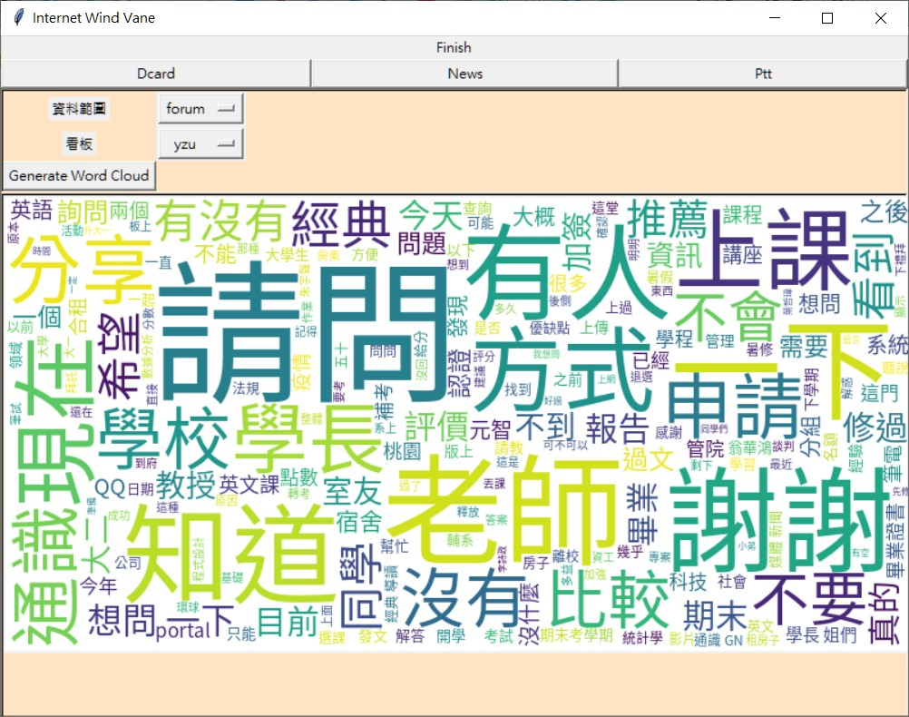
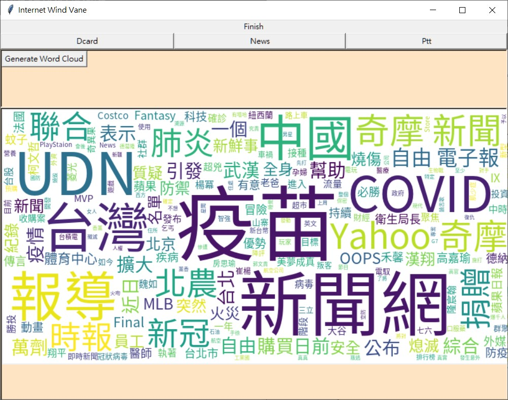
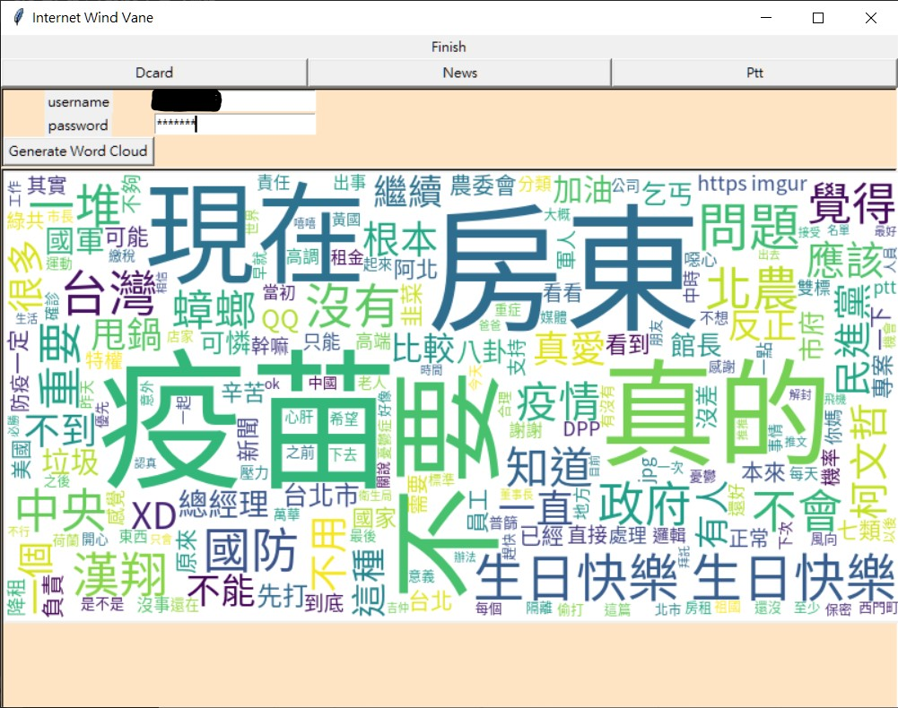

# 網路風向儀 internet_wind_vane

## Introduction
在網路論壇，每天有數以萬計的文章產生，但是大量的文章數難以閱讀，以人力分析是一件費時費力的工作。
而在大量的文字中，會有許多重複的語詞，將語助詞(例如，哇、喔)、連結詞(例如，和、還有)去除之後，剩下的名詞、動詞等，大致上可以稱為關鍵字。
關鍵字出現頻率越高，越有可能是當前的熱門話題。

Dcard是以大學生為主的匿名論壇，除了一般性的討論，還有提供校園看板，讓不同大學有各自獨立的討論，話題也比較貼近校園生活。
NEWS API提供各國的新聞，能以簡單的方式做篩選，以及取得資料。
Ptt是台大的BBS，長年下來有許多人在上面討論，對於網路言論有一定的影響力。

本程式將會使用API去抓取資料，分別使用[Dcard API](#dcard-api)、[NEWS API](#news-api)，以及[PyPTT](#pyptt)，去抓取在Dcard、台灣新聞，以及Ptt的內容。
並且使用jieba處裡中文分詞問題，還有除去非必要的語助詞、連結詞。
GUI介面是使用tkinter來建立，再使用word cloud(文字雲)來視覺化呈現關鍵詞的熱門度

## Build Process
### Required Packages Installation
```shell
pip3 install -r requirements.txt
```
file: [requirements.txt](requirements.txt)

### Execute
```shell
python3 internet_wind_vane.py
```

## Detail
### Project Structure
<pre>
.
└── internet_wind_vane
    ├── README.md
    ├── api
    │   ├── __init__.py
    │   ├── dcard.py    -> Dcard API
    │   ├── news.py     -> NEWS API
    │   ├── ptt.py      -> PyPTT
    │   ├── font
    │   │   └── SourceHanSansTW-Regular.otf -> word cloud image chinese font
    │   ├── res
    │   │   ├── dict.txt    -> For jieba default dictionary
    │   │   ├── idf.txt     -> For jieba TF-IDF Algorithm
    │   │   ├── stop.txt    -> For jieba stop word (不出現的字詞、符號)
    │   │   └── user.txt    -> For jieba user-defined dictionary
    │   └── variable.py
    ├── image
    │   └── cloud.png   -> word cloud image
    ├── internet_wind_vane.py   -> main enter
    ├── requirements.txt
    ├── result
    │   ├── result_dcard_api.jpg
    │   ├── result_news_api.jpg
    │   └── result_pyptt.jpg
    ├── test
    └── window.py   -> GUI
</pre>

### Dcard API
**Dcard API**使用`GET` **request**，根據不同的參數可以獲得**json**的**response**。
主要是抓取熱門文章，和看版的文章，並取得`title`和`excerpt`的資訊。

#### Example
```curl
# 取得100份全部文章分類的熱門文章
GET https://www.dcard.tw/service/api/v2/posts?popular=true&limit=100

# 取得100份元智大學看板的文章
GET https://www.dcard.tw/service/api/v2/forums/yzu/posts?limit=100
```

```json
[
    {
        "id":236303953,
        "title":"標題",
        "excerpt":"摘要",
        "anonymousSchool":true,
        "anonymousDepartment":true,
        "pinned":false,
        "forumId":"42851318-b9e2-4a75-8a05-9fe180becefe",
        "replyId":236300230,
        "createdAt":"2021-06-21T02:13:40.449Z",
        "updatedAt":"2021-06-22T01:03:37.740Z",
        "commentCount":227,
        "likeCount":7314,
        "withNickname":false,
        "tags":["HIDE_THUMBNAIL"],
        "topics":["*","*","*","*","*"],
        "meta":{"layout":"classic"},
        "globalPinned":null,
        "forumName":"*",
        "forumAlias":"relationship",
        "nsfw":false,
        "gender":"F",
        "replyTitle":"*",
        "reacted":null,
        "liked":false,
        "subscribed":false,
        "collected":false,
        "personaSubscribed":false,
        "mediaMeta":[],
        "read":false,
        "newComment":false,
        "currentMember":false,
        "reactions":[
            {"id":"286f599c-f86a-4932-82f0-f5a06f1eca03","count":7056},
            {"id":"e8e6bc5d-41b0-4129-b134-97507523d7ff","count":250},
            {"id":"011ead16-9b83-4729-9fde-c588920c6c2d","count":6},
            {"id":"4b018f48-e184-445f-adf1-fc8e04ba09b9","count":2},
            {"id":"514c2569-fd53-4d9d-a415-bf0f88e7329f","count":1}
        ],
        "hidden":false,
        "customStyle":null,
        "isSuspiciousAccount":false,
        "isModerator":false,
        "layout":"classic",
        "spoilerAlert":false,
        "totalCommentCount":227,
        "withImages":false,
        "withVideos":false,
        "media":[],
        "reportReasonText":"",
        "excerptComments":[],
        "postAvatar":"",
        "verifiedBadge":false,
        "memberType":""
    }
]
```
### NEWS API
**NEWS API**需要申請API key，有提供`GET` **request**或是**client**套件，這裡使用`GET`來實作。
資料內容是台灣的頭條新聞，並分析`title`和`description`

#### Example
```curl
# 取得100份台灣頭條新聞的熱門文章
https://newsapi.org/v2/top-headlines?country=tw&apiKey=API_KEY&pageSize=100
```

```json
{
    "status": "ok",
    "totalResults": 34,
    "articles": [
        {
            "source": 
            {
                "id": null,
                "name": "Yahoo Entertainment"
            },
            "author": "作者",
            "title": "標題",
            "description": "摘要",
            "url": "url",
            "urlToImage": "image_url",
            "publishedAt": "2021-06-21T23:40:03Z",
            "content": null
        },
        ...
    ]
}
```

### PyPtt
**PyPtt**在使用上，需要登入Ptt帳號才可以使用。
資料分析的是*Gossiping*的最近20篇，推文數75以上的文章及其推文(留言)

#### Analysis Data
```python
# 文章內容
post_info.content

# 推文內容
for push_info in post_info.push_list: 
    push_info.content
```

### Data Process Pseudo Code
```python
def get_data(options)
  data = request API with options
  data = data.convert_json
  
  words = list
  for item in data:
    item = filter_data(item)
    words append jieba.process(item)
    
  return words
```

## Result
1. Dcard API 
2. NEWS API 
3. PyPTT 

## Reference
1. [Dcard API](https://blog.jiatool.com/posts/dcard_api_v2/)
2. [PyPtt](https://github.com/PttCodingMan/PyPtt)
3. [NEWS API](https://newsapi.org/)
4. [jieba](https://github.com/fxsjy/jieba)
5. [WordCloud](https://amueller.github.io/word_cloud)
6. [tkinter document](https://tkdocs.com/)
